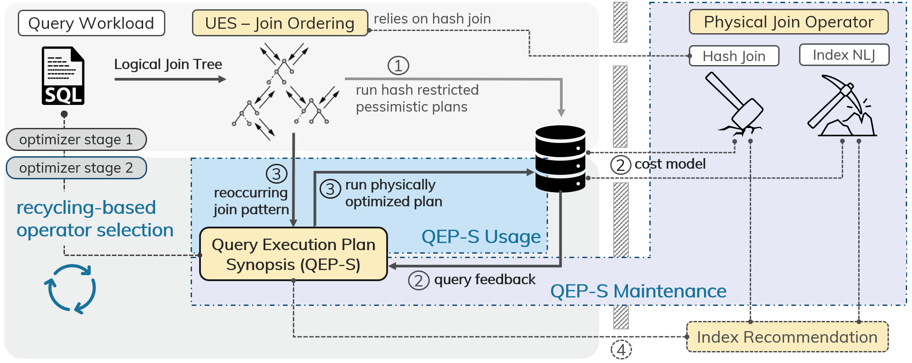

# TONIC
Repository of the paper: Turbo-Charging SPJ Query Plans with Learned Physical Join Operator Selections. [[paper](https://vldb.org/pvldb/vol15/p2706-hertzschuch.pdf)] [[presentation](https://www.youtube.com/watch?v=yzXDygl8fBg)]

VLDB'22

This repository contains scripts to evaluate core characteristics of the QEP-S. Each sub-directory contains a folder with precomputed query feedback. The <em> Quick Evaluation</em> scripts do not require any actual database connection. The steps for (re)computing the respective feedback and statistics are detailed in <em> Verbose Evaluation</em>.

## Requirements: ##
- sudo apt install build-essential cmake python3-pip libpq-dev python3-dev
- sudo pip3 install psycopg2
- sudo pip3 install glob2 

## Quick Evaluation: 

1. **Individual Experiments:** To run individual experiments use **`run_qeps.sh`** in the corresponding sub-directories. Running the experiments may require the installation of additional modules via `pip3 install`. Please run **`dataShift/run_qeps.sh`** at least once as other experiments, e.g., the adaptivity evaluation, may require a <em>pretrained</em> QEPS-S from the reduced data set.

2. **All Experiments:** To run all experiments subsequently, please execute **`run_all_experiments.sh`**.

## Verbose Evaluation: 

Recomputation of the query feedback and statistics requires the following steps:

1. **PostgreSQL:** [Install Postgres](https://www.postgresql.org/download/linux/ubuntu/) and load the (frozen,) [official IMDB data](https://github.com/gregrahn/join-order-benchmark) or [[CSV files](https://cloudstore.zih.tu-dresden.de/index.php/s/eqWWK53CgkxMxfA)].
2. **Reduced-Data:** Create another JOB instance where half the tuples from tables with at least 100k tuples are randomly dropped.
3. **Query-Feedback:** [Install the plan_hint_extension](https://github.com/ossc-db/pg_hint_plan) (see documentation [here](https://pghintplan.osdn.jp/pg_hint_plan.html)). Using the extension, execute each query with all possible physical operator combinations. For details see `utils/operatorPermutation`.
4. **Miscellaneous**: To stop QEP-S branching for already empty join results, `utils/getIntermediateSize.py` recomputes the necessary intermediate result sizes. Lastly, filter expressions for the <em>filter-aware</em> QEP-S have been extracted according to `utils/filterDict.py`.

## Vision: Two-Stage Cardinality-Estimation-Free Optimizer Design
In the future we seek to update this repository to provide a <em>generic</em> end-to-end implementation of TONIC combined with [Simplicity (UES)](https://github.com/axhertz/SimplicityDoneRight). 

Starting with a fresh workload, the two-stage design works as follows: 

1. In the first stage, <em>TONIC</em> receives the join order determined by the Simplicity query optimizer and searches for the longest prefix match within the  <em>QEP-S</em> to find the most similar case. Since there is no workload history yet, the <em>QEP-S</em> is unable to identify a prefix match for the first query. In accordance, to the <em>UES</em> policy, we apply hash joins for the initial execution of an unknown join order.

2. We use the actual join cardinalities as input for the default optimizer's cost model to determine the cost of every physical join operator alternative. Based on the cost feedback, we revise the operator decision of the previous step. 

3. For the next queries, we again generate the logical plans according to <em>UES</em>. 
However, <em>TONIC</em> additionally uses the <em>QEP-S</em> to determine the most cost effective join operators for already known join orders. For (partial) join orders that are not contained in the <em>QEP-S</em>, <em>TONIC</em> falls back to hash joins and updates the <em>QEP-S</em> with the respective query feedback, afterward. 

4. Interestingly, since <em>TONIC</em> accumulates the cost of operator alternatives, we can approximate an index significance rating from the <em>QEP-S</em> cost history. <em>TONIC</em> can use this rating to automatically detect benecficial or unnecessary indices.
